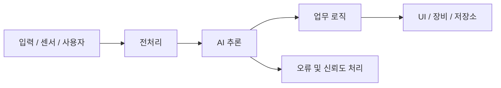

# High Level Design

> 상태: 주제 확정 후 작성

## 설계 원칙

- 문제 정의와 유스케이스에서 필요한 모듈만 둡니다.
- 우리 팀이 직접 구현하는 영역과 외부 모듈을 구분합니다.
- AI 모델의 학습·변환·추론 흐름을 재현 가능하게 기록합니다.
- 입력 오류, 낮은 신뢰도, 통신 실패 시 동작을 명시합니다.

## 시스템 흐름

위 도식은 자리표시자이며 주제 확정 후 실제 구조로 교체합니다.

## 모듈 정의

| 모듈 | 책임 | 직접 구현/외부 | 입력 | 출력 | 담당 |
| --- | --- | --- | --- | --- | --- |
| 입력 | TODO | TODO | TODO | TODO | TODO |
| 전처리 | TODO | TODO | TODO | TODO | TODO |
| AI | TODO | TODO | TODO | TODO | TODO |
| 업무 로직 | TODO | TODO | TODO | TODO | TODO |
| UI·장비 | TODO | TODO | TODO | TODO | TODO |

## 기술 스택

| 영역 | 후보 | 선택 근거 | 상태 |
| --- | --- | --- | --- |
| 언어 | TODO | TODO | 미정 |
| AI 프레임워크 | TODO | TODO | 미정 |
| Intel 가속 | OpenVINO 등 검토 | 측정 후 기록 | 미정 |
| 하드웨어 | TODO | TODO | 미정 |
| UI/API | TODO | TODO | 미정 |

## 배포와 실행

- 개발 환경:
- 실행 장비:
- 외부 의존성:
- 시작·종료 순서:
- 장애 복구:
