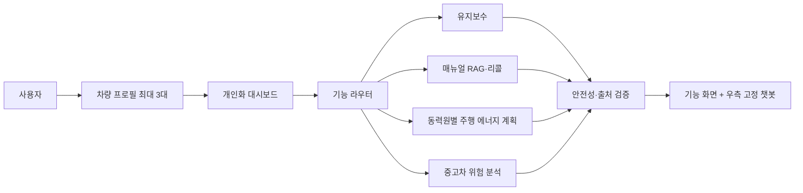

# High Level Design

## 1. 시스템 개요

하나의 웹 애플리케이션에서 최대 3대의 차량 프로필, 개인화 대시보드, 기능별 위젯과 상시 챗봇을 제공합니다. 메뉴 선택과 현재 차량을 명시적인 라우팅 정보로 사용하며, LLM이 임의로 차량 데이터나 외부 사실을 만들지 않도록 구조화된 도구와 출처 검증 계층을 둡니다.

## 2. 전체 흐름



## 3. 사용자 인터페이스

| 영역 | 책임 |
| --- | --- |
| 상단 차량 선택기 | 현재 차량 표시·전환·등록 |
| 좌측 메뉴 | 유지보수·차량 설명·실생활 |
| 중앙 작업영역 | 카드, 입력 폼, 지도, 분석 결과 |
| 우측 챗봇 | 현재 차량과 현재 기능 문맥을 유지한 대화 |
| 알림 | 리콜, 입력 누락, 외부 API 상태 |

## 4. 모듈

| 모듈 | 책임 | 주요 입력 | 주요 출력 |
| --- | --- | --- | --- |
| Vehicle Profile | 차량 최대 3대와 현재 차량 | 모델·연식·트림 | 정규화 차량 제원 |
| Dashboard | 개인화 카드와 빠른 실행 | 현재 차량·캐시 | 리콜·매뉴얼·동력원별 플래너 카드 |
| Chat Router | 메뉴·의도에 맞는 도구 호출 | 질문·현재 화면 | 기능 호출 계획 |
| Maintenance | 경고등·증상 안전 안내 | 증상·규칙·매뉴얼 | 위험도와 다음 행동 |
| Manual RAG | 매뉴얼 검색과 근거 답변 | 차량·질문 | 답변·문서 위치 |
| Recall Adapter | 공식 리콜 API 정규화 | 차종·연식 | 리콜 목록·조회시각 |
| Drive Energy Planner | 활성 차량의 동력원에 따라 전기·수소 충전소 또는 지정연료 주유소 비교 | EV: SoC·전비, 수소차: 주행가능거리, 내연기관: 주행가능거리·지정연료, 공통: 경로 | 충전 또는 주유 후보·우회시간·근거 |
| Used-car Risk | 점검표·보험자료 분석 | 링크·파일·수치 | 위험 등급·근거·신뢰도 |
| Safety & Evidence | 출력 검증과 출처 표시 | 모든 모듈 결과 | 사실/계산/추정 구분 |

## 5. 외부 연동

| 연동 | 목적 | 장애 시 처리 |
| --- | --- | --- |
| 길찾기 API | 거리·경로·예상 주행시간 | 거리 직접 입력 |
| 충전소 OpenAPI | 전기차 충전기 위치·출력·상태 | 캐시와 상태시각 경고 |
| 수소충전소 데이터 | 수소충전소 위치·운영시간·충전 가능 상태 | 상태 미확인 표시·직접 검색 링크 |
| 주유소 데이터 | 일반·고급·초고급 휘발유와 일반·하이세탄 경유 취급점 탐색 | 취급 여부 미확인 표시·직접 검색 링크 |
| 리콜 OpenAPI | 차종별 안전정보 | 재시도·원문 링크 |
| 매물 페이지 | 공개 매물 정보 | 파일 업로드·직접 입력 |
| 로컬 문서·모델 | RAG와 추론 | 미지원 안내 |

## 6. 기술 스택

| 계층 | 기술 |
| --- | --- |
| Frontend | React, TypeScript, Vite |
| Backend | Python 3.12, FastAPI |
| Database | SQLite |
| AI/RAG | OpenVINO GenAI, 임베딩, 벡터 검색 |
| External API | 길찾기, 전기차·수소 충전소, 리콜 |
| Test/CI | Pytest, frontend test, GitHub Actions |

FastAPI 백엔드 기반은 ADR-0002로 확정했습니다. OpenVINO, 임베딩과 벡터 검색 방식은 별도 실행 실험 후 추가 ADR로 결정합니다.

## 7. 데이터 모델

```text
User
 └─ VehicleProfile (최대 3)
     ├─ current 선택 상태
     ├─ VehicleSpecification
     ├─ ManualDocument
     ├─ RecallCache
     ├─ DriveEnergyPlan (EV, 수소전기차 또는 내연기관)
     └─ Conversation

UsedCarAnalysis
 ├─ ListingSnapshot
 ├─ InspectionDocument
 ├─ InsuranceSummary
 └─ RiskAssessment
```

## 8. 안전성과 증거

- 차량 제원과 리콜은 구조화 데이터에서만 가져옵니다.
- 매뉴얼 답변에는 문서명·페이지 또는 절을 표시합니다.
- EV 결과에는 입력값, 계산식, 외부 데이터 시각을 표시합니다.
- 중고차 결과는 사고 확정이 아닌 가능성·신뢰도·확인 항목으로 표현합니다.
- 즉시 위험 가능성이 있는 유지보수 응답은 운행보다 안전 확보를 우선합니다.
- 외부 API 오류와 데이터 없음은 성공처럼 처리하지 않습니다.

## 9. 현재 제외 모듈

다음 기능은 이번 구현·시연 범위에 포함하지 않습니다.

- OBD-II 연동
- 타이어 사진 분석
- 자동차 소음 분류

향후 데이터셋, 장비와 검증 절차가 준비된 경우 별도 모듈로 추가할 수 있습니다.
